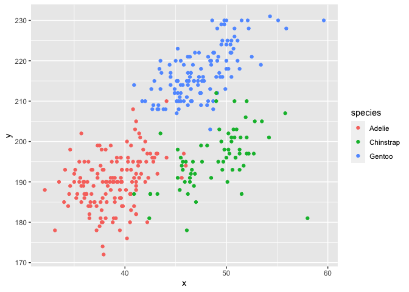

Homework 1
================
Ling Tuo
09/19/2020

  - [Problem 1](#problem-1)
  - [Problem 2](#problem-2)

This is my solution to HW1.

``` r
library(tidyverse)
```

## Problem 1

Create a dataframe with specified elements.

``` r
prob1_df = 
  tibble(
    samp = rnorm(10),
    samp_gt_0 = samp > 0,
    char_vec = c("a", "b", "c", "d", "e", "f", "g", "h", "i", "j"),
    factor_vec = factor(c("low", "low", "low", "mod", "mod", "mod", "mod", "high", "high", "high"))
  )
```

Take the mean of each variable in my data frame.

``` r
mean(pull(prob1_df, samp))
## [1] 0.0198998
mean(pull(prob1_df, samp_gt_0))
## [1] 0.4
mean(pull(prob1_df, char_vec))
## Warning in mean.default(pull(prob1_df, char_vec)): argument is not numeric or
## logical: returning NA
## [1] NA
mean(pull(prob1_df, factor_vec))
## Warning in mean.default(pull(prob1_df, factor_vec)): argument is not numeric or
## logical: returning NA
## [1] NA
```

I can take the mean of numbers and logical but not character or factor.

``` r
as.numeric(pull(prob1_df, samp))
##  [1]  0.06594766 -0.10715312 -0.11407270 -0.18602095  0.40131555 -0.23372958
##  [7]  1.60326320 -1.61679147 -0.67479337  1.06103278
as.numeric(pull(prob1_df, samp_gt_0))
##  [1] 1 0 0 0 1 0 1 0 0 1
as.numeric(pull(prob1_df, char_vec))
## Warning: NAs introduced by coercion
##  [1] NA NA NA NA NA NA NA NA NA NA
as.numeric(pull(prob1_df, factor_vec))
##  [1] 2 2 2 3 3 3 3 1 1 1
```

Logical and factor variables can be converted into numeric but character
cannot.

``` r
as.numeric(pull(prob1_df, samp_gt_0))*pull(prob1_df, samp)
##  [1] 0.06594766 0.00000000 0.00000000 0.00000000 0.40131555 0.00000000
##  [7] 1.60326320 0.00000000 0.00000000 1.06103278
as.factor(pull(prob1_df, samp_gt_0))*pull(prob1_df, samp)
## Warning in Ops.factor(as.factor(pull(prob1_df, samp_gt_0)), pull(prob1_df, : '*'
## not meaningful for factors
##  [1] NA NA NA NA NA NA NA NA NA NA
as.numeric(as.factor(pull(prob1_df, samp_gt_0)))*pull(prob1_df, samp)
##  [1]  0.1318953 -0.1071531 -0.1140727 -0.1860209  0.8026311 -0.2337296
##  [7]  3.2065264 -1.6167915 -0.6747934  2.1220656
```

## Problem 2

Load the `penguins` dataset:

``` r
data("penguins", package = "palmerpenguins")
```

Description of the `penguins` dataset:

  - The names of the variables in the dataset are **species, island,
    bill\_length\_mm, bill\_depth\_mm, flipper\_length\_mm,
    body\_mass\_g, sex, year**.

  - The values of these variables can be generally described as follows.
    
      - The variable **species** has class factor and levels are Adelie,
        Chinstrap, Gentoo.
    
      - The variable **island** has class factor and levels are Biscoe,
        Dream, Torgersen.
    
      - The variable **bill\_length\_mm** has class numeric with a range
        of \[32.1, 59.6\].
    
      - The variable **bill\_depth\_mm** has class numeric with a range
        of \[13.1, 21.5\].
    
      - The variable **flipper\_length\_mm** has class integer with a
        range of \[172, 231\].
    
      - The variable **body\_mass\_g** has class integer with a range of
        \[2700, 6300\].
    
      - The variable **sex** has class factor and levels are female,
        male.
    
      - The variable **year** has class integer with a range of \[2007,
        2009\].

  - The dataset has 344 rows (elements) and 8 columns (variables).

  - The mean of the flipper length is 200.9152047.

Here is the scatterplot of flipper\_length\_mm (y) vs bill\_length\_mm
(x):

``` r
plot_df = tibble(
  x = pull(penguins, bill_length_mm),
  y = pull(penguins, flipper_length_mm)
)
species = pull(penguins, species)
ggplot(plot_df, aes(x = x, y = y, color = species)) + geom_point(na.rm = TRUE)
```

<!-- -->

Export the scatterplot.

``` r
ggsave("plot_hw1.pdf")
```
